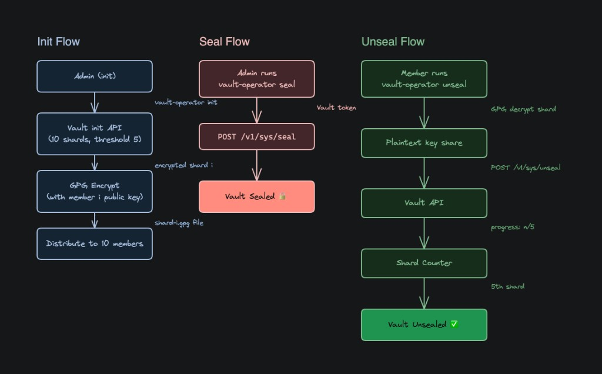

# HashiCorp Vault GPG Operator (Local Setup)

This repo provides a small Go CLI, `vault-operator`, that:

- Initializes Vault (Shamir split: `secret_shares` / `secret_threshold`)
- Encrypts each unseal key shard to a specific member's GPG public key
- Lets each member decrypt exactly their shard and submit it to `sys/unseal`
- Can seal Vault again using the root token

## Architecture (high level)

1. `vault-operator init` calls `PUT /v1/sys/init` to obtain `keys_base64`
2. Each `keys_base64[i]` is encrypted with `member-i`'s GPG public key into `shard-i.gpg`
3. A member runs `vault-operator unseal --shard shard-i.gpg --private-key member-i-private.asc`
4. The decrypted base64 key is submitted to `POST /v1/sys/unseal`

## Flow diagram



## Prerequisites

Install and keep these available on your PATH:

- `docker` (with `docker compose`)
- `go` (1.22+)
- `gpg`

Quick checks:

```bash
docker --version
docker compose version
go version
gpg --version
```

## Step-by-step local setup

### 1) Install project dependencies

From the project root:

```bash
go mod tidy
```

### 2) Start Vault

```bash
docker compose up -d
```

Vault listens on `http://127.0.0.1:18300`.

### 3) Generate GPG keys for members

```bash
chmod +x scripts/generate-gpg-keys.sh
./scripts/generate-gpg-keys.sh 10 ./keys
```

This creates:

- `keys/member-1-public.asc` ... `keys/member-10-public.asc`
- `keys/member-1-private.asc` ... `keys/member-10-private.asc`

If you want private keys to be passphrase-protected, set `GPG_PASSPHRASE` before running the script.

### 4) Initialize Vault and write encrypted shards

```bash
go run ./cmd/vault-operator init \
  --gpg-keys ./keys \
  --out-dir ./out \
  --secret-shares 10 \
  --secret-threshold 5
```

Outputs:

- `out/shard-1.gpg ... out/shard-10.gpg`
- `out/root-token.txt`

### 5) Unseal Vault (members)

Each unsealer runs:

```bash
go run ./cmd/vault-operator unseal \
  --shard ./out/shard-3.gpg \
  --private-key ./keys/member-3-private.asc
```

If private keys are passphrase-protected:

```bash
export GPG_PASSPHRASE="your-passphrase"
go run ./cmd/vault-operator unseal --shard ./out/shard-3.gpg --private-key ./keys/member-3-private.asc
```

After enough shards (>= threshold), Vault becomes unsealed.

### 6) Seal Vault again (admin/root)

```bash
export VAULT_TOKEN="$(cat ./out/root-token.txt)"
go run ./cmd/vault-operator seal --token "$VAULT_TOKEN"
```

## Web UI (write + fetch secrets with Enter button)

After Vault is unsealed, you can launch a local UI and fetch secrets in the browser.

Start UI:

```bash
go run ./cmd/vault-operator ui --vault-addr http://127.0.0.1:18300
```

Open:

`http://127.0.0.1:8080`

### Step-by-step example (store your name and fetch it)

1. Unseal Vault first (submit enough shards with `vault-operator unseal`).
2. Get root/admin token:
   ```bash
   export VAULT_TOKEN="$(cat ./out/root-token.txt)"
   ```
3. In UI, go to **Create Secret**:
   - Token: paste `$VAULT_TOKEN`
   - Secret Path: `secret/my-name`
   - Field Key: `name`
   - Field Value: your name (for example: `Armaan`)
   - Click **Save Secret**
4. In UI, go to **Enter (Fetch Secret)**:
   - Token: same token
   - Secret Path: `secret/my-name`
   - Click **Enter**
5. The value appears in the result box as JSON.

## Env Vars / Flags

- `--vault-addr` / `VAULT_ADDR`
- `--vault-tls-insecure` / `VAULT_TLS_INSECURE`
- `--vault-client-timeout-s` / `VAULT_CLIENT_TIMEOUT_S`
- `GPG_PASSPHRASE` (optional)
- `VAULT_TOKEN` (optional for `seal`)

## Before pushing to GitHub

This project generates sensitive local files during normal usage. Do not commit them.

- `keys/` (private/public key exports)
- `out/` (encrypted shards + `root-token.txt`)
- `vault-data/` (Vault runtime storage)

A `.gitignore` is included to keep these out of Git.

If these files were already committed in another local copy, rotate credentials and re-key before using that setup in real environments.

## Initial Git push (first time)

From the project root:

```bash
git init
git add .
git commit -m "Initial commit: Vault GPG operator local workflow"
git branch -M main
git remote add origin <your-github-repo-url>
git push -u origin main
```

